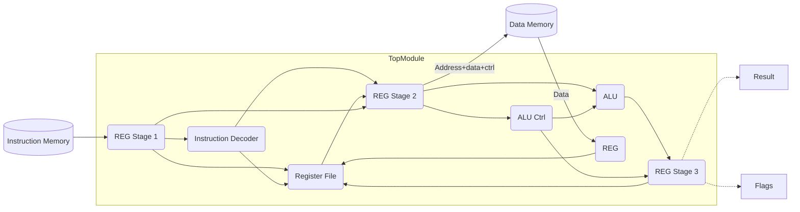

# Processor Documentation


## Table of Contents
- [1. Introduction](#1-introduction)
- [2. Processor Overview](#2-processor-overview)
  - [2.1 Final Top Module](#21-final-top-module)
  - [2.2 Register File Module](#22-register-file-module)
  - [2.3 ALU Module](#23-alu-module)
  - [2.4 Instruction Decoder](#24-instruction-decoder)
- [3. Testbench](#3-testbench)
  - [3.1 Testbench Overview](#31-testbench-overview)
  - [3.2 Test Phases](#32-test-phases)
  - [3.3 SRAM Module](#33-sram-module)
  - [3.4 Test Vectors](#34-test-vectors)
    - [3.4.1 Instruction Input Test Vector](#341-instruction-input-test-vector)
    - [3.4.2 Expected Output Test Vectors](#342-expected-output-test-vectors)
    - [3.4.3 Test Program](#343-test-program)
  - [3.5 Evaluation Procedure](#35-evaluation-procedure)
- [4. Usage](#4-usage)
---

## 1. Introduction
[[Top](#table-of-contents)] <br><br>
This documentation covers the design and testing of a custom-built 3-stage processor. The processor is designed using Verilog and is intended for educational and simulation purposes. It demonstrates basic processor operations including arithmetic, logical, and memory interactions.

## 2. Processor Overview
[[Top](#table-of-contents)] <br><br>
The processor is structured as a simple pipelined architecture, capable of executing a set of predefined instructions. It consists of several modules including a register file, arithmetic logic unit (ALU)  instruction decoder, and memory interface.

### 2.1 Final Top Module
[[Top](#table-of-contents)] <br><br>
The `final_top` module is the primary module that orchestrates the operations of the processor. It includes the following interfaces:
- `clk`: Clock input.
- `rst`: Active high reset signal.
- `instruction`: 32-bit instruction input.
- `data_in`: 16-bit data input from memory.
- `data_out`: 16-bit data output to memory.
- `addr`: Memory address output.
- `we`: Write enable signal for memory operations.
- `out_reg`: Output of the ALU.
- `zero`, `carry`: Flags for ALU operations.

### 2.2 Register File Module
[[Top](#table-of-contents)] <br><br>
The `reg_file` module manages the processor's register set. It includes:
- Read and write capabilities for 16-bit registers.
- Separate read and write ports for simultaneous operations.
- Synchronous write operations with the clock.
- Reset utility (high).

### 2.3 ALU Module
[[Top](#table-of-contents)] <br><br>
The ALU performs arithmetic and logical operations based on the input opcode. It supports operations like addition, subtraction - with carry and immediate - bitwise AND, OR, XOR, and shift operations (left, right and right signed).

### 2.4 Instruction Decoder
[[Top](#table-of-contents)] <br><br>
The `instruction_decoder` interprets the 32-bit instructions, separating the opcode, source registers, destination register, and immediate values.

---
## 3. Testbench
[[Top](#table-of-contents)] <br><br>
The testbench simulates the processor's environment, providing inputs and verifying outputs against expected results.

### 3.1 Testbench Overview
[[Top](#table-of-contents)] <br><br>
The testbench drives the `final_top` module with a series of instructions and checks the outputs against expected values provided in test vector files.

### 3.2 Test Phases
[[Top](#table-of-contents)] <br><br>
Each test consists of four phases across ten clock cycles, involving the setup of input registers and the execution and validation of an instruction.

### 3.3 SRAM Module
[[Top](#table-of-contents)] <br><br>
The external SRAM module simulates a simple memory interface. It includes:
- 16-bit data input and output.
- Address input and write enable control.
- Synchronous write and asynchronous read operations.
It interfaces with the processor in the test bench.

### 3.4 Test Vectors
[[Top](#table-of-contents)] <br><br>
The validation of the processor's functionality is conducted using a suite of meticulously prepared test vector files. These files contain both the input instructions for the processor and the expected outputs for each test, formatted in binary for precision and clarity.

#### 3.4.1 Instruction Input Test Vector
- **File Name**: `instructions_program.tv`
- **Format**: Binary (32 bits per line)
- **Content**: A sequence of 48 instructions that drive the processor's operation.
- **Purpose**: Each line in this file represents a distinct instruction (32-bit wide) fed into the processor, orchestrating its operation through various test scenarios.

#### 3.4.2 Expected Output Test Vectors
[[Top](#table-of-contents)] <br><br>
The expected output of the processor for each test is detailed in separate files, each correlating to specific output registers of the `final_top` module:

- **Data Output (`data_out`)**
  - **File Name**: `data_out.tv`
  - **Format**: Binary (16 bits per line)
  - **Lines**: 16
  - **Description**: Represents the expected data to be output to memory for each test.

- **ALU Output (`out_reg`)**
  - **File Name**: `out_reg.tv`
  - **Format**: Binary (16 bits per line)
  - **Lines**: 16
  - **Description**: Contains the expected results from the ALU operations.

- **Address Output (`addr`)**
  - **File Name**: `addr.tv`
  - **Format**: Binary (16 bits per line)
  - **Lines**: 16
  - **Description**: Specifies the expected memory addresses used in memory operations.

- **Write Enable Signal (`we`)**
  - **File Name**: `we.tv`
  - **Format**: Binary (1 bit per line)
  - **Lines**: 16
  - **Description**: Indicates the expected state of the write enable signal for each test.

- **Zero Flag (`zero`)**
  - **File Name**: `zero.tv`
  - **Format**: Binary (1 bit per line)
  - **Lines**: 16
  - **Description**: Captures the expected zero flag status, signifying if the ALU operation results in zero.

- **Carry Flag (`carry`)**
  - **File Name**: `carry.tv`
  - **Format**: Binary (1 bit per line)
  - **Lines**: 16
  - **Description**: Details the expected carry flag status, indicating a carry-out or borrow in ALU operations.

#### 3.4.3 Test Program
[[Top](#table-of-contents)] <br><br>
The program consists of 48 instructions to evaluate 16 tests, 3 instructions per main test vector evaluation. This is done in order to prepare REG1 in the first instruction `ADDI, X0, REG1, IMMEDIATE` with a value, REG2 in the second instruction `ADDI, X0, REG2, IMMEDIATE` with another value, then execute the third instruction, which is the main instruction for the test evaluation. To achieve this, the register `X0` is kept with a value 0 throughout the entire program. <br>
The following is an assembly version of the instruction program:
```assembly
ADDI X0, X2, 0x5763
ADDI X0, X2, 0x5508
NOP
ADDI X0, X8, 0x6050 
ADDI X0, X1, 0x5045
STORE X8, 0x1139
ADDI X0, X15, 0xc9a5
ADDI X0, X11, 0x58b1
LOAD X15, 0x1139
ADDI X0, X13, 0xe537 
ADDI X0, X6, 0xcf40
ADDC X13, X6, X4
ADDI X0, X14, 0xfb97
ADDI X0, X10, 0xa7ea
SUBC X14, X10, X11
ADDI X0, X4, 0x76ed
ADDI X0, X12, 0xb43c
AND X4, X12, X13
ADDI X0, X10, 0x00af
ADDI X0, X7, 0xba92
OR X10, X7, X5
ADDI X0, X13, 0xc991
ADDI X0, X15, 0xa114
XOR X13, X15, X3
ADDI X0, X4, 0x08c7 
ADDI X0, X10, 0x000c
SHL X4, X10, X14
ADDI X0, X15, 0xff00
ADDI X0, X5, 0x0005
SHR X15, X5, X10
ADDI X0, X12, 0xdbd5
ADDI X0, X3, 0x0003
SHRA X12, X3, X13
ADDI X0, X2, 0x4001
ADDI X0, X14, 0xffff
ADDI X2, X6, 0x2000
ADDI X0, X14, 0xf0f0
ADDI X0, X4, 0x4f4f
SUBI X14, X7, 0x9140
ADDI X0, X7, 0x7777
ADDI X0, X9, 0x9999
ANDI X7, X10, 0x4444
ADDI X0, X11, 0xbbbb
ADDI X0, X6, 0x6666
ORI X11, X13, 0xdddd
ADDI X0, X12, 0xcccc
ADDI X0, X8, 0x4444
XORI X12, X14, 0xeeee
```

### 3.5 Evaluation Procedure
[[Top](#table-of-contents)] <br><br>
In each test, the processor's outputs are rigorously compared against these expected values. This comprehensive approach ensures that every aspect of the processor's functionality is validated, from data handling and arithmetic operations to flag settings and memory interactions.

## 4. Usage
[[Top](#table-of-contents)] <br><br>
To use the processor and testbench:
1. Load the processor design and testbench in your Verilog simulation environment.
2. Ensure the test vector files are in the correct location.
3. Run the simulation and observe the outputs.
4. Check the test summary for any failed tests and debug as needed.
